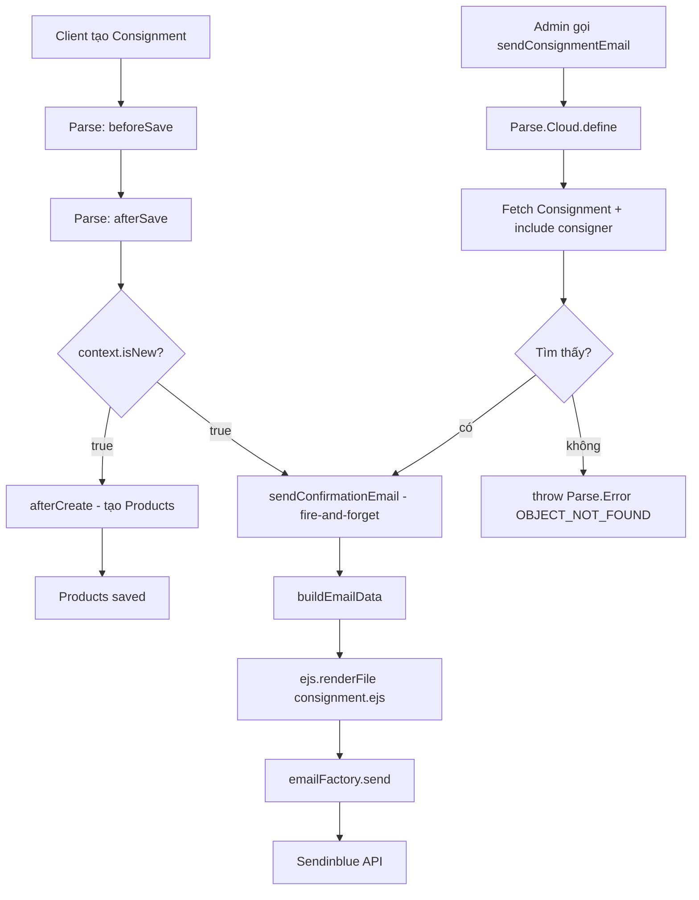

# Design Document: Consignment Confirmation Email

## Overview

Feature này implement việc gửi email xác nhận biên nhận ký gửi (consignment confirmation email) tự động và thủ công cho hệ thống GiveAwayPremium.

**Phạm vi thay đổi:**

1. Thêm hàm `sendConsignmentEmail` vào `src/cloud/function/mail.ts`
2. Cập nhật `src/cloud/consignment/index.ts` — gọi email trong `afterCreate`
3. Cập nhật `src/cloud/main.ts` — register Cloud Function mới

**Không thay đổi:** Template EJS (`consignment.ejs`), `MailFactory`, `emailFactory` singleton, schema Consignment/User.

---

## Architecture

Luồng dữ liệu bao gồm hai entry point:



**Nguyên tắc thiết kế chính:**

- `afterSave` gọi cả `afterCreate` (Products) và email **không await** — fire-and-forget, đảm bảo response về client không bị block
- Mọi lỗi trong `sendConfirmationEmail` được bắt nội bộ, chỉ log — không re-throw
- `sendConsignmentEmail` Cloud Function chia sẻ cùng core logic với auto-send trong `afterCreate`

---

## Components and Interfaces

### 1. `buildEmailData(consignment: Consignment): ConsignmentEmailData`

Hàm pure function (không có side effects) chịu trách nhiệm extract và transform data từ Consignment object thành format phù hợp với EJS template.

```typescript
interface ConsignmentEmailData {
  customerName: string;
  phoneNumber: string;
  identityId: string;
  consignmentId: string;
  numberOfProduct: number;
  bankName: string;
  bankId: string;
  timeGetMoney: string; // format DD-MM-YYYY
  timeCheck: string; // timeGetMoney - 3 ngày, cùng format
  products: ProductEmailItem[];
}

interface ProductEmailItem {
  name: string;
  amount: number; // từ rawProduct.count
  status: string; // từ rawProduct.rateNew
  price: number;
  priceAfterFee: number;
}
```

**Mapping logic:**

| Template field      | Nguồn                                                                         | Fallback |
| ------------------- | ----------------------------------------------------------------------------- | -------- |
| `customerName`      | `consigner.get('name')`                                                       | `''`     |
| `phoneNumber`       | `consigner.get('phone')`                                                      | `''`     |
| `identityId`        | `consigner.get('identityId')`                                                 | `''`     |
| `consignmentId`     | `consignment.id`                                                              | —        |
| `numberOfProduct`   | `consignment.get('productList').length`                                       | `0`      |
| `bankName`          | `consignment.get('bankName')`                                                 | `''`     |
| `bankId`            | `consignment.get('bankId')`                                                   | `''`     |
| `timeGetMoney`      | `consignment.get('timeGetMoney')`                                             | `''`     |
| `timeCheck`         | `moment(timeGetMoney, 'DD-MM-YYYY').subtract(3, 'days').format('DD-MM-YYYY')` | `''`     |
| `products[].amount` | `rawProduct.count`                                                            | —        |
| `products[].status` | `rawProduct.rateNew`                                                          | `''`     |

### 2. `sendConfirmationEmail(consignment: Consignment): Promise<void>`

Hàm internal (không export), thực hiện toàn bộ pipeline gửi email cho một Consignment cụ thể.

```typescript
const sendConfirmationEmail = async (
  consignment: Consignment
): Promise<void> => {
  try {
    const consigner = consignment.getConsigner();
    const email = consigner.get('mail') as string;

    if (!email) {
      console.warn(
        `[sendConfirmationEmail] consigner ${consigner.id} không có email — bỏ qua`
      );
      return;
    }

    const data = buildEmailData(consignment);
    const html = await ejs.renderFile(
      EMAIL_PATHS[EMAIL_TYPES.CONSIGNMENT],
      data
    );

    await emailFactory.send({
      mailTo: email,
      title: `Give Away Premium - Biên nhận ký gửi ${consignment.id}`,
      html,
    });
  } catch (error) {
    console.error(
      `[sendConfirmationEmail] Lỗi gửi email cho consignment ${consignment?.id}:`,
      error
    );
    // Không re-throw — fire-and-forget
  }
};
```

### 3. `sendConsignmentEmail` (exported Cloud Function handler)

```typescript
export const sendConsignmentEmail = async (
  request: Parse.Cloud.FunctionRequest<{ consignmentId: string }>
): Promise<{ success: boolean }> => {
  const { consignmentId } = request.params;
  const query = new Parse.Query(Consignment);
  const consignment = await query
    .equalTo('objectId', consignmentId)
    .include('consigner')
    .first({ useMasterKey: true });

  if (!consignment) {
    throw new Parse.Error(
      Parse.Error.OBJECT_NOT_FOUND,
      `Consignment ${consignmentId} không tồn tại`
    );
  }

  await sendConfirmationEmail(consignment);
  return { success: true };
};
```

### 4. Cập nhật `afterCreate` trong `src/cloud/consignment/index.ts`

```typescript
const afterCreate = async (
  request: Parse.Cloud.AfterSaveRequest<Consignment>
) => {
  const consignment = request.object;

  // Tạo Products (logic hiện có, giữ nguyên)
  const rawProducts = consignment.get('productList');
  const productPromises = rawProducts.map(async rawProduct => {
    /* ... */
  });
  await Promise.all(productPromises);

  // Gửi email xác nhận — fire-and-forget, KHÔNG await
  sendConfirmationEmailInternal(consignment);
};
```

> **Lưu ý:** `sendConfirmationEmailInternal` là alias cho `sendConfirmationEmail` được import từ `mail.ts`, hoặc hàm này được tách ra để `consignment/index.ts` có thể gọi. Xem phần Data Models để biết cách tổ chức exports.

### 5. Registration trong `src/cloud/main.ts`

```typescript
import {
  remiderIndividualConsignment,
  reminderConsignmentGroup,
  sendConsignmentEmail, // ← thêm mới
} from './function/mail';

// ...

Parse.Cloud.define<(param: { consignmentId: string }) => { success: boolean }>(
  'sendConsignmentEmail',
  sendConsignmentEmail,
  {
    requireUser: true,
    fields: {
      consignmentId: {
        required: true,
        type: String,
        options: (val: string) => !!val,
        error: 'consignmentId là bắt buộc và không được rỗng',
      },
    },
  }
);
```

---

## Data Models

### Tổ chức file — tránh circular dependency

`consignment/index.ts` cần gọi `sendConfirmationEmail` từ `function/mail.ts`. Đây là dependency một chiều hợp lệ:

```
cloud/function/mail.ts
    ↑ import
cloud/consignment/index.ts
    ↑ import
cloud/main.ts
```

**Không có circular dependency** vì `mail.ts` không import từ `consignment/index.ts`.

Cách cụ thể:

- `mail.ts` export thêm `sendConfirmationEmail` (ngoài các exports hiện có)
- `consignment/index.ts` import `sendConfirmationEmail` từ `../function/mail`

### Consignment fields sử dụng

```typescript
// Từ Consignment object (Parse.Object)
consignment.id; // string — objectId
consignment.get('productList'); // RawProduct[] — array inline (không phải Pointer)
consignment.get('bankName'); // string | undefined
consignment.get('bankId'); // string | undefined
consignment.get('timeGetMoney'); // string — format 'DD-MM-YYYY'
consignment.getConsigner(); // Parse.User

// Từ consigner (Parse.User)
consigner.get('mail'); // string | undefined — email address
consigner.get('name'); // string | undefined
consigner.get('phone'); // string | undefined
consigner.get('identityId'); // string | undefined
```

### Raw product item shape (từ `productList` array)

```typescript
interface RawProduct {
  key: string;
  name: string;
  price: number;
  count: number;
  priceAfterFee: number;
  rateNew: string; // e.g. "99%", "Mới", "Like New"
  note?: string;
  code?: string;
  categoryId: string;
  subCategoryId?: string;
  moneyBackProduct?: number;
}
```

---

## Correctness Properties

_A property là một đặc tính hoặc hành vi phải đúng trong mọi lần thực thi hợp lệ của hệ thống — về cơ bản là một phát biểu chính thức về những gì hệ thống phải làm. Properties là cầu nối giữa đặc tả dạng con người đọc được và đảm bảo correctness có thể kiểm tra tự động._

### Property 1: buildEmailData maps đầy đủ tất cả required fields

_For any_ Consignment object với consigner hợp lệ, hàm `buildEmailData()` phải trả về object có đủ tất cả các fields: `customerName`, `phoneNumber`, `identityId`, `consignmentId`, `numberOfProduct`, `bankName`, `bankId`, `timeGetMoney`, `timeCheck`, và `products` array với từng item có `name`, `amount`, `status`, `price`, `priceAfterFee`. Không có field nào được là `undefined`.

**Validates: Requirements 1.2, 3.1, 3.2, 3.3, 3.4, 3.6, 3.7**

### Property 2: timeCheck luôn là timeGetMoney trừ 3 ngày

_For any_ chuỗi ngày hợp lệ theo format `DD-MM-YYYY` được set làm `timeGetMoney`, `buildEmailData()` phải tính `timeCheck` bằng cách trừ đúng 3 ngày và giữ nguyên format `DD-MM-YYYY`.

**Validates: Requirements 3.5**

### Property 3: productList được map 1-1 thành products array

_For any_ `productList` array với N items (N ≥ 0), `buildEmailData()` phải trả về `products` array có đúng N items, trong đó mỗi item có `amount` bằng `count` của raw product tương ứng, và `status` bằng `rateNew`.

**Validates: Requirements 3.6**

### Property 4: sendConfirmationEmail không bao giờ throw ra ngoài

_For any_ Error object (với bất kỳ message hay type nào) được throw bởi `emailFactory.send()` hoặc `ejs.renderFile()`, hàm `sendConfirmationEmail()` phải bắt exception đó nội bộ và return bình thường mà không re-throw.

**Validates: Requirements 1.4, 4.2**

### Property 5: sendConsignmentEmail gọi emailFactory.send với mailTo đúng

_For any_ Consignment object có consigner với email hợp lệ, khi gọi `sendConsignmentEmail` (hoặc `sendConfirmationEmail` nội bộ), `emailFactory.send()` phải được gọi đúng một lần với `mailTo` bằng địa chỉ email của consigner đó.

**Validates: Requirements 1.1, 2.2**

---

## Error Handling

### Phân cấp lỗi

| Tình huống                                                   | Xử lý                                   | Log level |
| ------------------------------------------------------------ | --------------------------------------- | --------- |
| Consigner không có email                                     | Return sớm, không gửi                   | `warn`    |
| `ejs.renderFile` thất bại (template missing, bad data)       | Catch, log, return                      | `error`   |
| `emailFactory.send` thất bại (Sendinblue API error, network) | Catch, log, return                      | `error`   |
| `query.first()` trả về null trong Cloud Function             | Throw `Parse.Error(OBJECT_NOT_FOUND)`   | —         |
| Consignment không có `productList`                           | `buildEmailData` dùng `[]` làm fallback | —         |

### Pattern fire-and-forget

```typescript
// ĐÚNG — trong afterCreate
sendConfirmationEmail(consignment); // không await, không catch ở ngoài

// SAI — sẽ block afterSave hoặc leak unhandled rejection
await sendConfirmationEmail(consignment);
```

Bởi vì `sendConfirmationEmail` đã catch tất cả errors nội bộ, việc không await trong `afterCreate` là an toàn và không gây unhandled rejection.

---

## Testing Strategy

### Unit Tests (Jest)

**File:** `src/cloud/function/mail.spec.ts`

Tập trung vào `buildEmailData` (pure function) và `sendConfirmationEmail` (với mock emailFactory):

```typescript
// Test examples
describe('buildEmailData', () => {
  it('maps all required fields with complete consignment data');
  it(
    'returns empty strings for missing optional fields (bankName, bankId, identityId)'
  );
  it('maps products[].amount from rawProduct.count');
  it('maps products[].status from rawProduct.rateNew');
  it('returns empty products array when productList is empty');
});

describe('sendConfirmationEmail', () => {
  it('does not call emailFactory.send when consigner has no email');
  it('calls emailFactory.send with correct mailTo when email exists');
  it('does not throw when emailFactory.send rejects');
  it('does not throw when ejs.renderFile rejects');
});
```

### Property-Based Tests (fast-check)

Dùng [fast-check](https://github.com/dubzzz/fast-check) — library PBT cho TypeScript/JavaScript.

Cấu hình: **minimum 100 runs** mỗi property.

**Tag format:** `Feature: consignment-confirmation-email, Property {N}: {description}`

**Property 1 — buildEmailData maps đầy đủ all fields:**

```typescript
// Feature: consignment-confirmation-email, Property 1: buildEmailData maps all required fields
fc.assert(
  fc.property(
    arbitraryConsignment(), // generates random Consignment with random field values
    consignment => {
      const data = buildEmailData(consignment);
      expect(data.customerName).toBeDefined();
      expect(data.phoneNumber).toBeDefined();
      expect(data.identityId).toBeDefined();
      expect(data.consignmentId).toBeDefined();
      expect(data.bankName).toBeDefined();
      expect(data.bankId).toBeDefined();
      expect(data.timeGetMoney).toBeDefined();
      expect(data.timeCheck).toBeDefined();
      expect(Array.isArray(data.products)).toBe(true);
    }
  ),
  { numRuns: 100 }
);
```

**Property 2 — timeCheck = timeGetMoney - 3 ngày:**

```typescript
// Feature: consignment-confirmation-email, Property 2: timeCheck is timeGetMoney minus 3 days
fc.assert(
  fc.property(
    fc.date({ min: new Date('2020-01-04'), max: new Date('2030-12-31') }),
    date => {
      const timeGetMoney = moment(date).format('DD-MM-YYYY');
      const consignment = makeConsignmentWithDate(timeGetMoney);
      const data = buildEmailData(consignment);
      const expected = moment(date).subtract(3, 'days').format('DD-MM-YYYY');
      expect(data.timeCheck).toBe(expected);
    }
  ),
  { numRuns: 100 }
);
```

**Property 3 — productList mapping 1-1:**

```typescript
// Feature: consignment-confirmation-email, Property 3: productList maps 1-1 to products
fc.assert(
  fc.property(
    fc.array(arbitraryRawProduct(), { minLength: 0, maxLength: 20 }),
    productList => {
      const consignment = makeConsignmentWithProducts(productList);
      const data = buildEmailData(consignment);
      expect(data.products).toHaveLength(productList.length);
      data.products.forEach((p, i) => {
        expect(p.amount).toBe(productList[i].count);
        expect(p.status).toBe(productList[i].rateNew);
      });
    }
  ),
  { numRuns: 100 }
);
```

**Property 4 — sendConfirmationEmail không throw:**

```typescript
// Feature: consignment-confirmation-email, Property 4: sendConfirmationEmail never throws
fc.assert(
  fc.property(
    fc.string(), // random error message
    fc.boolean(), // true = renderFile throws, false = send throws
    async (errorMsg, renderFails) => {
      if (renderFails)
        mockEjsRenderFile.mockRejectedValueOnce(new Error(errorMsg));
      else mockEmailSend.mockRejectedValueOnce(new Error(errorMsg));
      await expect(
        sendConfirmationEmail(mockConsignment)
      ).resolves.not.toThrow();
    }
  ),
  { numRuns: 100 }
);
```

**Property 5 — mailTo đúng với email của consigner:**

```typescript
// Feature: consignment-confirmation-email, Property 5: emailFactory.send called with correct mailTo
fc.assert(
  fc.property(
    fc.emailAddress(), // generates valid email addresses
    async email => {
      const consignment = makeConsignmentWithEmail(email);
      await sendConfirmationEmail(consignment);
      expect(mockEmailSend).toHaveBeenCalledWith(
        expect.objectContaining({ mailTo: email })
      );
    }
  ),
  { numRuns: 100 }
);
```

### Integration Tests

- Verify Cloud Function `sendConsignmentEmail` được register trong main.ts với `requireUser: true`
- Verify `consignmentId` validation schema hoạt động đúng (empty string bị reject)
- Verify afterSave trigger không await email — dùng test với artificial delay để confirm non-blocking
